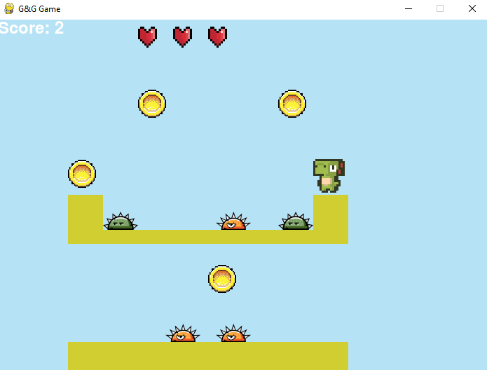

# G&G Game - Proyecto Final de Modelos de Programacion I
This is the final project of the Programming Models I course of the 2024-2 Intersemester guided by Professor Lilia Marcela Espinosa Rodriguez, in which it was decided to make a platform game to implement the different design patterns for both the creation, structure and behavior of entities and objects in the game. This project was made by me Carlos Gongora and Santiago Guarguati.

This project was thought and designed in python using the pygame extension, because we wanted the game to be made based on code only and not use any external engine to help its creation. A series of videos were also used where they explain the creation of the platform video game, what was done was to transfer the design patterns and apply them to the creation of the game.

    

        
    

    

        
    

### Especial Thanks for:

- Thanks to Rik Cross for his Python and [Pygame Platform video series](https://www.youtube.com/@RikCross)
  
- Thanks to Arks for the [DinoCharacters](https://arks.itch.io/dino-characters)

- Thanks to DasBilligeAlien for [Rotating Coin](https://opengameart.org/content/rotating-coin-0)

- Thanks to bevouliin.com for [Bevouliin Free Ingame Items - Spike Monsters](https://opengameart.org/content/bevouliin-free-ingame-items-spike-monsters)

- Thanks to Nicole Marie T for [Heart 16*16](https://opengameart.org/content/heart-1616)

- Thanks to Eric Skiff for [Underclocked](https://www.youtube.com/watch?v=hrgzWEgCCFg)

- Thanks to Free Effects For Clips and Ambient Music and Sound for Video [Game Coin Beep Sound Effect](https://www.youtube.com/watch?v=88Icb7OKexU)

- Thanks to Karbon13 for [Jump Sound Effect](https://www.youtube.com/watch?v=Msx3flEqeq8)

- Thanks to Sounds for [Creator for Minecraft Damage - Sound Effect](https://www.youtube.com/watch?v=RMkKsZL3_uc)

- Thanks to KnightSheep for [FallingSoundEffect](https://www.youtube.com/watch?v=VaH9tIJyeaY)

